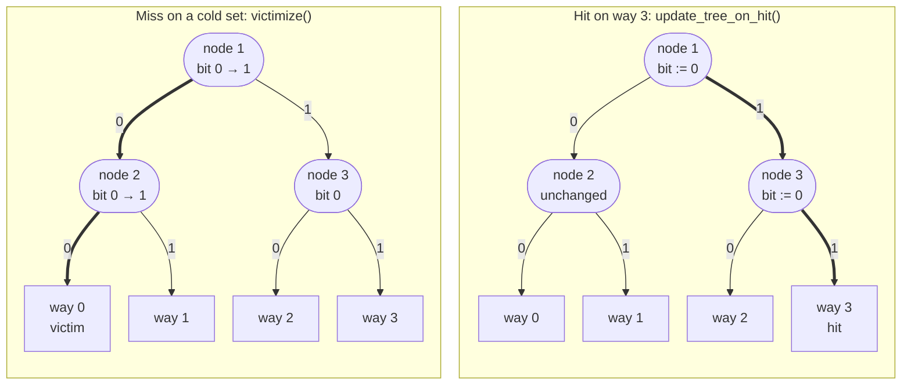
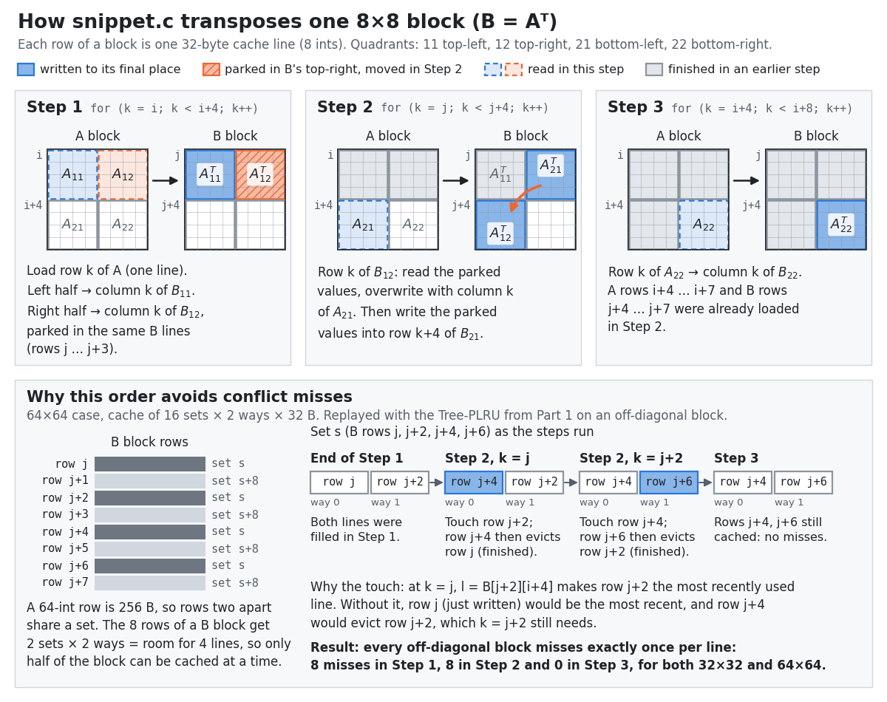

# Cache-Aware RISC-V Optimization


Memory-hierarchy optimisation from **both sides of the hardware/software boundary**:

1. **Hardware.** I implemented a **Tree-based Pseudo-LRU** replacement policy inside the
   [Spike](https://github.com/riscv-software-src/riscv-isa-sim) RISC-V simulator's L1 data-cache model.
2. **Software.** I rewrote a **matrix transpose** and the **GEMM kernel of an MLP** so that their
   access patterns fit a small cache. The GEMM kernel also uses RISC-V Vector (RVV) intrinsics.

> Lab 3 of my *Computer Organization* coursework (NCKU CSIE, Spring 2026).
> See the [full lab series](#lab-series) below.

## Results

Measured with the provided local judge. The transpose runs on a 16-set, 2-way, 32 B-line cache
(1 KiB).

| Part | Metric | Baseline | Mine | Change |
|------|--------|---------:|-----:|-------:|
| 1. Tree-PLRU | Public testcases matching the reference trace | — | **3 / 3** | exact match |
| 2. Transpose 32×32 | D-cache misses | 1,152 | **272** | **−76 %** |
| 2. Transpose 64×64 | D-cache misses | 4,608 | **1,344** | **−71 %** |

Part 3 (MLP) is evaluated on Spike with the customised cache model. It needs the course Docker
image. See [Build and run](#build-and-run).

## 1. Tree-PLRU replacement policy — `1_cachesim/`

Spike's cache model picks victims with an LFSR (pseudo-random). I replaced this with a per-set
binary tree of direction bits, stored as a heap-ordered array (`node 1` = root, children `2n` and
`2n+1`, leaves `ways … 2·ways−1`).

- **On a hit**, walk from the leaf to the root. Each parent is set to point *away* from the
  accessed child: `tree[node/2] = (node is left child)`.
- **On a miss**, walk from the root to a leaf, following each bit and flipping it on the way down.
  The leaf reached is the victim way.



<sub>One 4-way set, as in public testcase 2 (the code takes any power-of-two `ways`); bit 0 points
to child `2n`, bit 1 to `2n+1`. A miss follows the bits from the root and flips each one (from the
all-zero start it evicts way 0), and a hit points every parent on its path away from the accessed
way.</sub>

The tree has `ways − 1` direction bits per set (`plru_tree` keeps them one per byte, in `ways`
entries per set with index 0 unused), and each update touches O(log ways) nodes. It follows
the specification exactly, including the rule that invalid ways are *not* preferred. The same
`cachesim.{h,cc}` is dropped into Spike's source tree and reused by Parts 2 and 3.

Files: [`cachesim.h`](1_cachesim/cachesim.h), [`cachesim.cc`](1_cachesim/cachesim.cc)

## 2. Cache-blocked matrix transpose — `2_transpose/`

`B = Aᵀ` for 32×32 and 64×64 `int32` matrices, both 4 KiB-aligned. The cache is tiny, so `A[i]`
and `B[i]` land in the same sets, and rows only a few apart evict each other.

My [`snippet.c`](2_transpose/snippet.c) works on **8×8 blocks** (one 32 B line = 8 ints), split
into four 4×4 quadrants:

1. Read the top four rows of the `A` block, one full cache line each. Transpose the left half into
   its final place in `B`. **Park** the right half in `B`'s top-right quadrant, which is already in
   cache.
2. For each of the four `B` rows, swap the parked values out to their final quadrant and bring in
   `A`'s bottom-left column. In blocks off the diagonal, every line of `A` and `B` is loaded only
   once. Diagonal blocks, where `A` and `B` map to the same sets, take extra misses.
3. Transpose the bottom-right quadrant directly.



<sub>The three `k`-loops of `snippet.c` on one 8×8 block. The bottom half comes from replaying the
snippet's accesses through a Python port of the Part 1 cache
([`make_transpose_figure.py`](docs/figures/make_transpose_figure.py)), which reproduces the miss
counts in the table above.</sub>

The `l = B[..][..]` reads are deliberate extra accesses. They **touch a line to steer replacement**.
In the 64×64 case, off the diagonal, each of the four reads in Step 2 makes the `B` row I still need
the most recently used line in its set, so the next miss there evicts the row I have finished with
(bottom half of the figure). A Python replay of the `cachesim.cc` policy
([`make_transpose_figure.py`](docs/figures/make_transpose_figure.py), not a run of the C++
simulator) shows that these four reads are the only ones that matter: without them the 64×64 count
rises from 1,344 to 1,544 misses. The reads in Steps 1 and 3 do not change the count, and 32×32
stays at 272 misses with or without any of them. With 2 ways, Tree-PLRU is the same as true LRU, so
the trick needs a deterministic policy such as LRU or PLRU. It would not work with Spike's default
random (LFSR) replacement.

The code is restricted to the 12 provided scalar locals (`t0–t7, i, j, k, l`). No extra
arrays or pointers are allowed.

## 3. MLP inference GEMM with RVV — `3_mlp/`

The workload is a two-layer MLP (`784 → 128 → 10`, 300 samples) running on Spike. The score is
`InstCycles + MemCycles` (hit = 1 cycle, miss = 100 cycles) compared with a naive triple loop.

[`matmul_improved.c`](3_mlp/matmul_improved.c):

- **Vectorise along N.** Each `B[k][j : j+vl]` row segment is loaded once per group of four `C` rows
  and broadcast-multiplied into **all four rows at the same time** with `vfmacc.vf`, so the 4 × `vl`
  output tile stays in vector registers (`LMUL = 4`, 16 vregs) for a whole 16-deep block of `K`.
- **Loop tiling.** The loops are blocked into 16 rows of `A` and 16 values of `K`, so each 16 × `vl`
  strip of `B` is reused by every row of the block before the loop moves on.
- **Scalar-row tail loop** for `M % 4`.

[`dc_config.py`](3_mlp/dc_config.py) picks the data-cache geometry. I chose **8 sets × 8 ways ×
64 B = 4 KiB**, the largest cache the rules allow. The high associativity is aimed at conflict
misses: in the first layer, consecutive rows of `B` and `C` are 512 B apart (`N = 128` floats), so
the row segments of one strip fall into the same few sets.

## Repository layout

```
.
├── 1_cachesim/     # ★ cachesim.h / cachesim.cc — Tree-PLRU (C++), trace-driven judge
├── 2_transpose/    # ★ snippet.c — blocked transpose; Valgrind Lackey → csim → miss count
├── 3_mlp/          # ★ matmul_improved.c, dc_config.py — RVV GEMM + cache geometry
├── docs/figures/   # README figure and the script that draws it
└── Makefile        # make judge-{1,2,3,all}
```

★ = files I wrote or modified. Everything else is the course-provided framework.

## Build and run

Parts 1 and 2 only need `make`, `g++`, `gcc`, `python3`, `valgrind` and `git` (the judges compare
outputs with `git diff --no-index`):

```bash
make judge-1      # Tree-PLRU vs. reference traces (also builds csim_cpp for Part 2)
make judge-2      # transpose correctness + miss count
```

Part 3 needs the RISC-V toolchain and a Spike build that includes this cache model. Both come
with the course image:

```bash
docker run -it --name pa3 -v "$(pwd)":/workspace docker.io/asrlab/comp-org:pa3
# inside the container: install the PLRU cache model into Spike, then judge
cp /workspace/1_cachesim/cachesim.{h,cc} ~/riscv/riscv-isa-sim/riscv/
cd ~/riscv/riscv-isa-sim/build && make && make install
cd /workspace && make judge-3
```

## What I learned

- Why replacement policy, associativity and data layout have to be designed *together*. The
  transpose trick of steering replacement only works because the policy is deterministic and
  known (LRU or PLRU), not random.
- Reasoning about set-index aliasing (`addr >> idx_shift & (sets − 1)`) caused by power-of-two
  strides.
- Register-tiling a GEMM for a vector ISA while balancing instruction count against miss count.

## Lab series

| Lab | Repository | Topic |
|-----|------------|-------|
| 1 | [riscv-inline-asm-algorithms](https://github.com/Adam010341/riscv-inline-asm-algorithms) | RV64IF inline assembly |
| 2 | [rvv-mel-spectrogram](https://github.com/Adam010341/rvv-mel-spectrogram) | RISC-V Vector (RVV) intrinsics, FFT, DSP |
| 3 | **cache-aware-riscv-optimization** (this repo) | Tree-PLRU cache simulator, cache-blocked transpose, RVV GEMM |

---

<sub>The simulator framework, drivers, judges and test data were provided by the course staff
(the cache model is derived from Spike's `riscv/cachesim.{h,cc}`). The files marked ★ contain my
own work.</sub>
