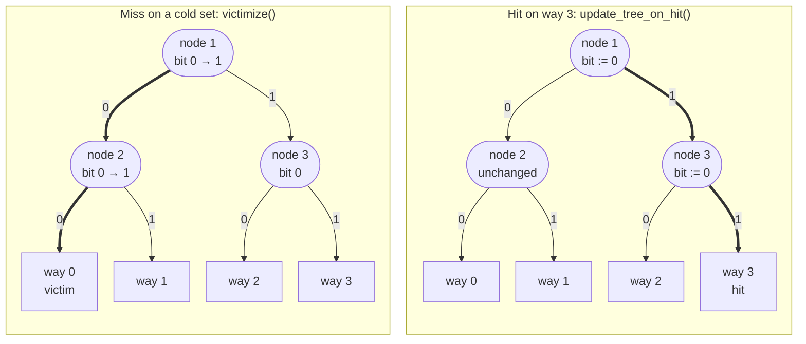
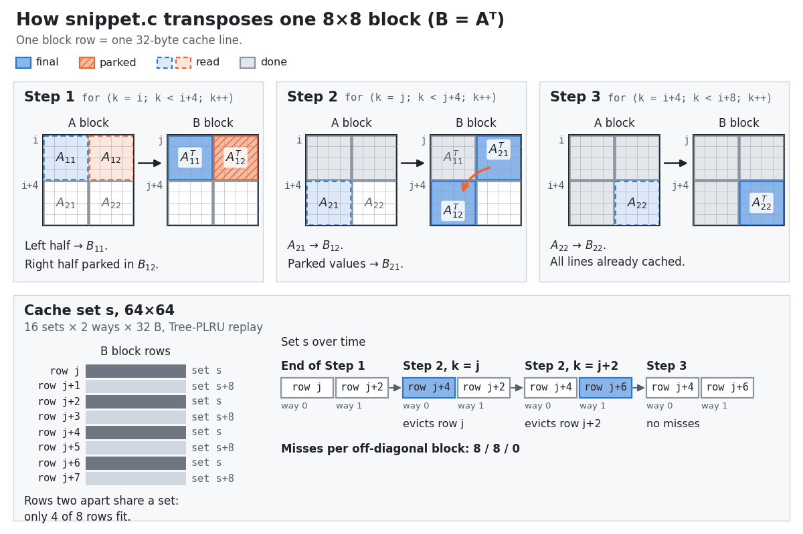

# Cache-Aware RISC-V Optimization


I added a Tree-PLRU replacement policy to the L1 data-cache model in the
[Spike](https://github.com/riscv-software-src/riscv-isa-sim) RISC-V simulator. I also wrote a
cache-blocked matrix transpose and a tiled MLP GEMM kernel using RVV.

> Lab 3 of *Computer Organization* (NCKU CSIE, Spring 2026). See the [lab series](#lab-series) below.

## Results

Measured with the provided local judge. The transpose runs on a 16-set, 2-way, 32 B-line cache
(1 KiB).

| Part | Metric | Baseline | Mine | Change |
|------|--------|---------:|-----:|-------:|
| 1. Tree-PLRU | Public testcases matching the reference trace | n/a | 3 / 3 | exact match |
| 2. Transpose 32×32 | D-cache misses | 1,152 | 272 | −76 % |
| 2. Transpose 64×64 | D-cache misses | 4,608 | 1,344 | −71 % |

Part 3 (MLP) runs on Spike with the customised cache model and needs the course Docker image.

## 1. Tree-PLRU replacement policy (`1_cachesim/`)

Spike's cache model picks victims with an LFSR (pseudo-random). I replaced it with a per-set binary
tree of direction bits, stored as a heap-ordered array (`node 1` = root, children `2n` and `2n+1`,
leaves `ways … 2·ways−1`).

- Hit: walk from the leaf to the root, setting each parent to point away from the accessed
  child: `tree[node/2] = (node is left child)`.
- Miss: walk from the root to a leaf, following each bit and flipping it on the way down. The
  leaf reached is the victim way.


```mermaid
%%{init: {"flowchart": {"nodeSpacing": 22, "rankSpacing": 38}}}%%
flowchart TB
    subgraph hit["Hit on way 3: update_tree_on_hit()"]
        direction TB
        h1(["node 1<br/>bit := 0"])
        h2(["node 2<br/>unchanged"])
        h3(["node 3<br/>bit := 0"])
        h4["way 0"]
        h5["way 1"]
        h6["way 2"]
        h7["way 3<br/>hit"]
        h1 -->|"0"| h2
        h1 ==>|"1"| h3
        h2 -->|"0"| h4
        h2 -->|"1"| h5
        h3 -->|"0"| h6
        h3 ==>|"1"| h7
    end
    subgraph miss["Miss on a cold set: victimize()"]
        direction TB
        m1(["node 1<br/>bit 0 → 1"])
        m2(["node 2<br/>bit 0 → 1"])
        m3(["node 3<br/>bit 0"])
        m4["way 0<br/>victim"]
        m5["way 1"]
        m6["way 2"]
        m7["way 3"]
        m1 ==>|"0"| m2
        m1 -->|"1"| m3
        m2 ==>|"0"| m4
        m2 -->|"1"| m5
        m3 -->|"0"| m6
        m3 -->|"1"| m7
    end
```

<sub>One 4-way set, as in public testcase 2. Bit 0 points to child `2n`, bit 1 to `2n+1`.</sub>

Each set has `ways − 1` direction bits and each update touches O(log ways) nodes. Invalid ways are
not preferred, as the spec says. The same `cachesim.{h,cc}` is used by Parts 2 and 3.

Files: [`cachesim.h`](1_cachesim/cachesim.h), [`cachesim.cc`](1_cachesim/cachesim.cc)

## 2. Cache-blocked matrix transpose (`2_transpose/`)

`B = Aᵀ` for 32×32 and 64×64 `int32` matrices, both 4 KiB-aligned. The cache is tiny, so `A[i]` and
`B[i]` land in the same sets and rows a few apart evict each other.

[`snippet.c`](2_transpose/snippet.c) works on 8×8 blocks (one 32 B line = 8 ints), split into
four 4×4 quadrants:

1. Read the top four rows of the `A` block. Transpose the left half into its final place in `B` and
   park the right half in `B`'s top-right quadrant, which is already in cache.
2. For each of the four `B` rows, swap the parked values out to their final quadrant and bring in
   `A`'s bottom-left column. Off the diagonal, every line of `A` and `B` is loaded once. Diagonal
   blocks take extra misses.
3. Transpose the bottom-right quadrant directly.



<sub>The bottom half is a replay of the snippet's accesses through a Python port of the Part 1 cache
([`make_transpose_figure.py`](docs/figures/make_transpose_figure.py)).</sub>

The `l = B[..][..]` reads are deliberate extra accesses. They touch a line to steer replacement.
In the 64×64 case, each of the four reads in Step 2 makes the `B` row I still need the most recently
used line in its set, so the next miss evicts the row I have finished with. In the Python replay,
removing those four reads raises the 64×64 count from 1,344 to 1,544 misses; 32×32 stays at 272.
It needs a deterministic policy (LRU or PLRU) and does nothing under Spike's default random
replacement.

The code is limited to the 12 provided scalar locals (`t0–t7, i, j, k, l`).

## 3. MLP inference GEMM with RVV (`3_mlp/`)

A two-layer MLP (`784 → 128 → 10`, 300 samples) on Spike. The score is `InstCycles + MemCycles`
(hit = 1 cycle, miss = 100 cycles) compared with a naive triple loop.

[`matmul_improved.c`](3_mlp/matmul_improved.c):

- Vectorise along N. Each `B[k][j : j+vl]` row segment is loaded once per group of four `C` rows
  and multiplied into all four rows with `vfmacc.vf`. The 4 × `vl` output tile stays in vector
  registers (`LMUL = 4`, 16 vregs) for a 16-deep block of `K`.
- Loop tiling. Blocks of 16 rows of `A` and 16 values of `K`, so each 16 × `vl` strip of `B` is
  reused by every row of the block.
- Scalar-row tail loop for `M % 4`.

[`dc_config.py`](3_mlp/dc_config.py) sets the data-cache geometry: 8 sets × 8 ways × 64 B =
4 KiB, the largest the rules allow. In the first layer, consecutive rows of `B` and `C` are 512 B
apart (`N = 128` floats), so the row segments of one strip fall into the same few sets. The high
associativity is aimed at those conflict misses.

## Repository layout

```
.
├── 1_cachesim/     # cachesim.h / cachesim.cc: Tree-PLRU (C++), trace-driven judge
├── 2_transpose/    # snippet.c: blocked transpose; Valgrind Lackey -> csim -> miss count
├── 3_mlp/          # matmul_improved.c, dc_config.py: RVV GEMM + cache geometry
├── docs/figures/   # README figure and the script that draws it
└── Makefile        # make judge-{1,2,3,all}
```

I wrote `cachesim.{h,cc}`, `snippet.c`, `matmul_improved.c` and `dc_config.py`. The rest is the
course-provided framework.

## Build and run

Parts 1 and 2 need `make`, `g++`, `gcc`, `python3`, `valgrind` and `git`:

```bash
make judge-1      # Tree-PLRU vs. reference traces (also builds csim_cpp for Part 2)
make judge-2      # transpose correctness + miss count
```

Part 3 needs the RISC-V toolchain and a Spike build with this cache model, both in the course image:

```bash
docker run -it --name pa3 -v "$(pwd)":/workspace docker.io/asrlab/comp-org:pa3
# inside the container: install the PLRU cache model into Spike, then judge
cp /workspace/1_cachesim/cachesim.{h,cc} ~/riscv/riscv-isa-sim/riscv/
cd ~/riscv/riscv-isa-sim/build && make && make install
cd /workspace && make judge-3
```

## Lab series

| Lab | Repository | Topic |
|-----|------------|-------|
| 1 | [riscv-inline-asm-algorithms](https://github.com/Adam010341/riscv-inline-asm-algorithms) | RV64IF inline assembly |
| 2 | [rvv-mel-spectrogram](https://github.com/Adam010341/rvv-mel-spectrogram) | RISC-V Vector (RVV) intrinsics, FFT, DSP |
| 3 | **cache-aware-riscv-optimization** (this repo) | Tree-PLRU cache simulator, cache-blocked transpose, RVV GEMM |

---

<sub>The simulator framework, drivers, judges and test data were provided by the course staff
(the cache model is derived from Spike's `riscv/cachesim.{h,cc}`).</sub>
